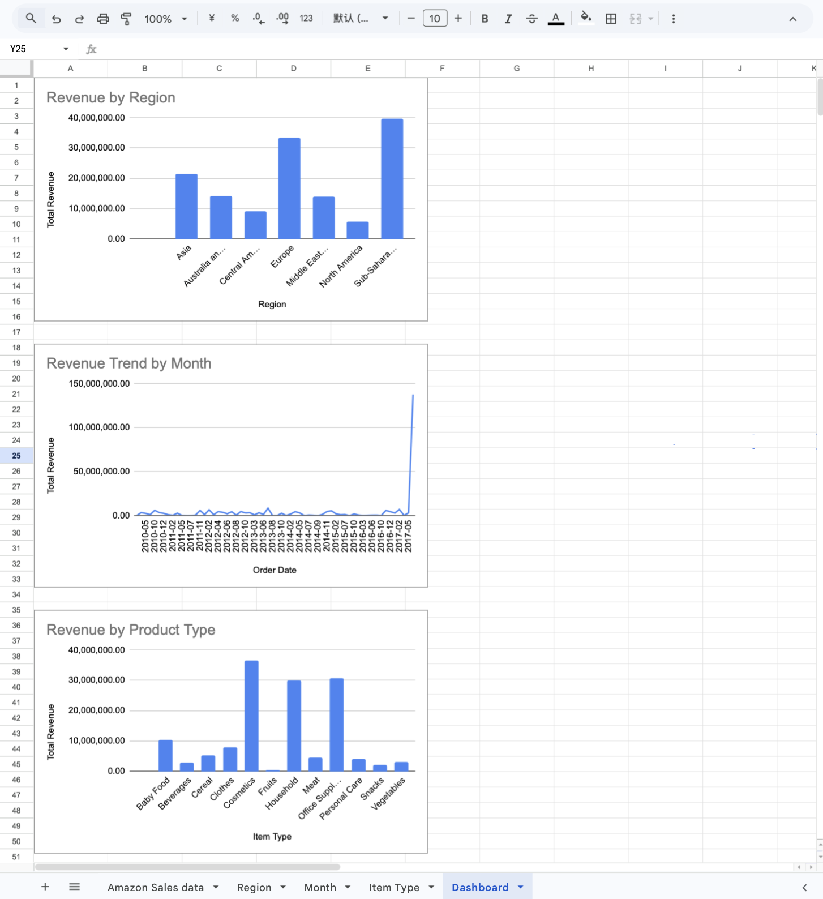

# Sales Dashboard Analysis

This project analyzes sales performance using Google Sheets pivot tables and charts.

## Dashboard Overview

The dashboard explores:

• Revenue by Region  
• Monthly Revenue Trends  
• Revenue by Product Category  

## Tools Used

- Google Sheets
- Pivot Tables
- Data Visualization

## Dashboard

## Key Insights

- Sub-Saharan Africa generated the highest revenue among regions.
- Monthly revenue trends show fluctuations with occasional spikes.
- Certain product categories such as Cosmetics and Office Supplies contribute significantly to overall revenue.
