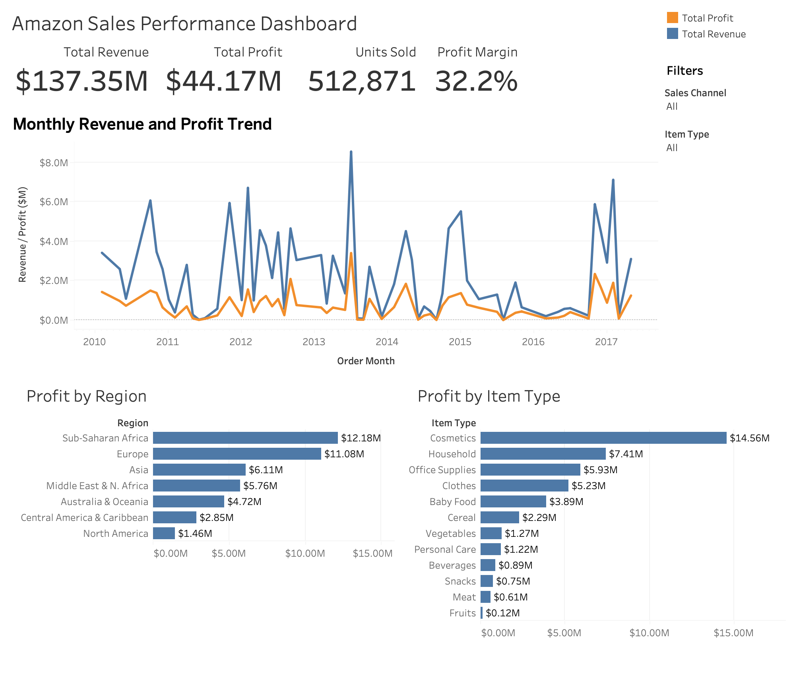

# Amazon Sales Performance Dashboard

## Overview

This project analyzes Amazon sales performance using **Tableau, SQL, Python, Pandas, and SQLite**. The interactive dashboard provides a business-focused view of revenue, profit, units sold, profit margin, monthly performance trends, regional profitability, and item-type performance.

## Interactive Dashboard

[View the Interactive Dashboard on Tableau Public](https://public.tableau.com/app/profile/kira.m5514/viz/AmazonSalesPerformanceDashboard_17797525905470/AmazonSalesPerformanceDashboard)

## Dashboard Preview

## Key Metrics

| Metric | Value |
| --- | ---: |
| Total Revenue | $137.35M |
| Total Profit | $44.17M |
| Units Sold | 512,871 |
| Profit Margin | 32.2% |

## Dashboard Features

- KPI overview of total revenue, total profit, units sold, and profit margin
- Monthly revenue and profit trend comparison from 2010 to 2017
- Profitability analysis by region
- Profitability analysis by item type
- Interactive filters for sales channel and item type
- Region-based chart selection that updates KPIs, monthly trends, and item-type analysis

## Tools Used

- **Tableau** — interactive dashboard development and data visualization
- **SQL / SQLite** — sales performance queries and metric analysis
- **Python / Pandas** — data cleaning, transformation, and validation

## Analysis Workflow

1. Cleaned and transformed sales data using Python and Pandas.
2. Validated revenue, cost, profit, sales channel, region, and item-type fields.
3. Loaded structured data into SQLite for SQL-based analysis.
4. Analyzed revenue, profit, units sold, regional performance, and product profitability.
5. Designed an interactive Tableau dashboard for business performance reporting.

## Key Insights

- Total sales revenue reached **$137.35M**, generating **$44.17M** in profit with a **32.2% profit margin**.
- **Sub-Saharan Africa** generated the highest profit among regions at **$12.18M**, followed by **Europe** at **$11.08M**.
- **Cosmetics** was the most profitable item type at **$14.56M**, followed by **Household** and **Office Supplies**.
- Monthly revenue and profit generally moved in the same direction, with notable performance spikes during selected periods.

## Project Files

- [Interactive Tableau Dashboard](https://public.tableau.com/app/profile/kira.m5514/viz/AmazonSalesPerformanceDashboard_17797525905470/AmazonSalesPerformanceDashboard)
- `Amazon_Sales_Dashboard.twbx` — packaged Tableau workbook
- `amazon_sales_dashboard_overview.png` — dashboard preview image
- `Amazon Sales data.csv` — source dataset

## Dashboard Interaction

The Tableau dashboard allows users to:

- Filter results by **Sales Channel**
- Filter results by **Item Type**
- Select a region directly from the chart to dynamically update KPIs, monthly trends, and item-type profitability analysis
